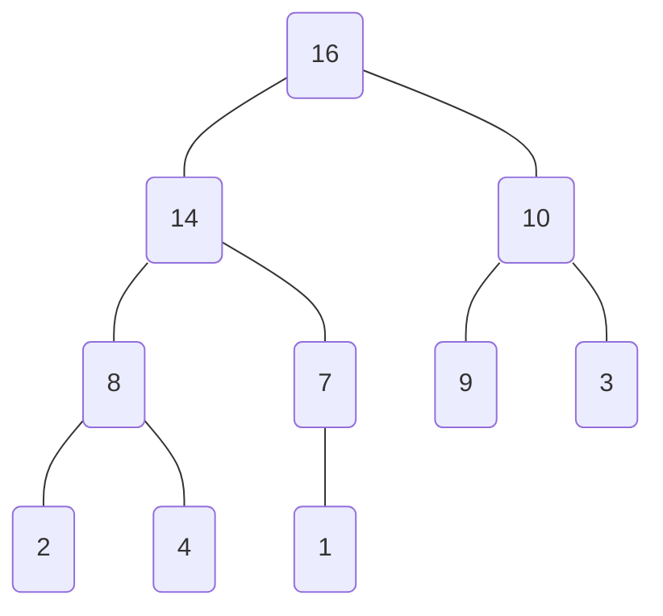
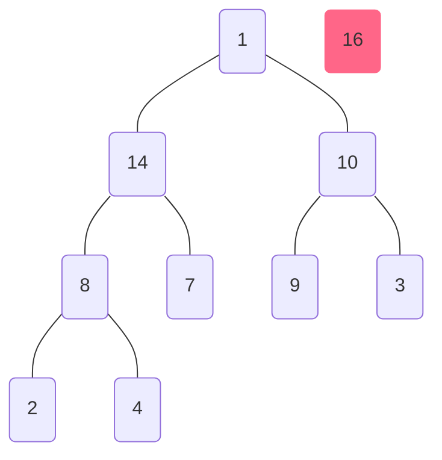
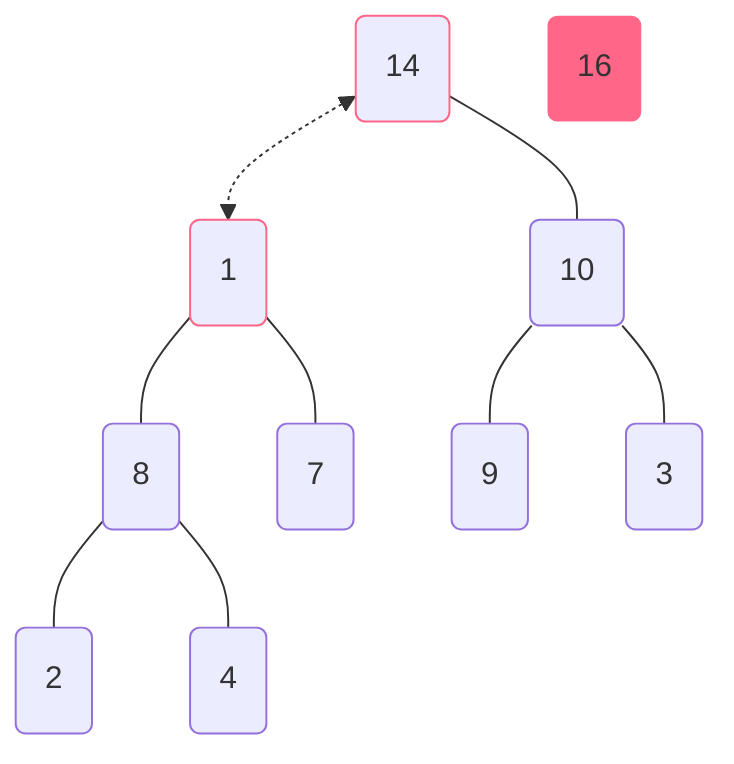
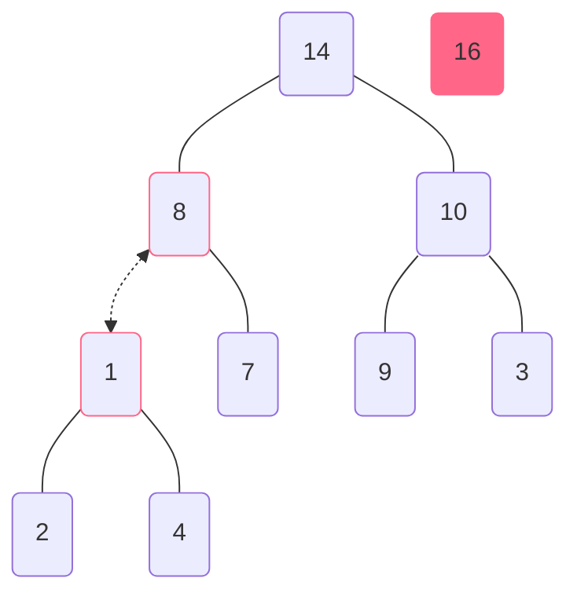
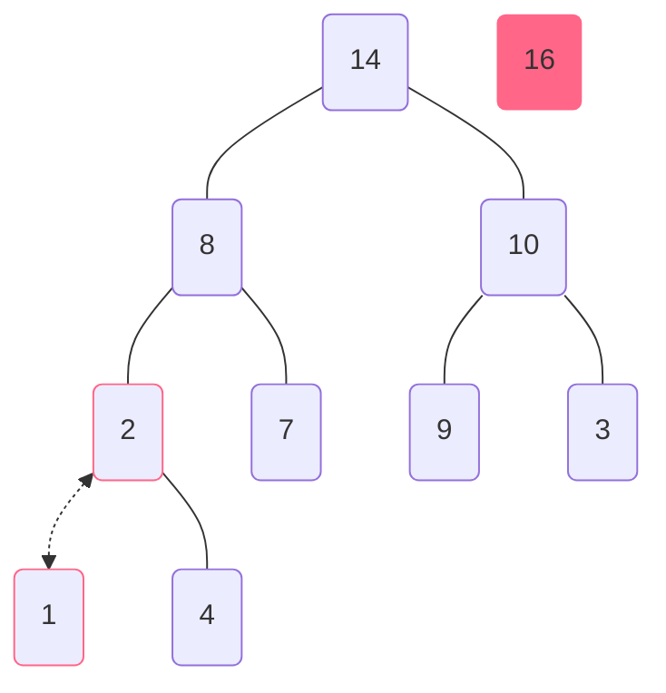
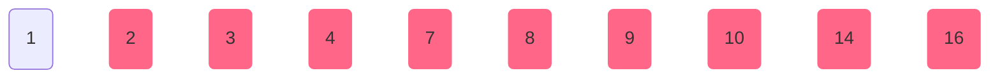

# 堆排序 `Heap Sort`

- `时间复杂度` $\Theta(n\log_{}{n})$
- `难度` ★★☆☆☆

[`↗ 代码实现`](heap_sort/heap_sort.md)

堆排序是一种不稳定排序算法。

堆排序的时间复杂度是 $O(n\log_{}{n})$，因此在大数据量的排序中表现优异。

> 在以下的过程中，假设我们要将一个长度为 `10` 的列表 `arr: list = [4, 1, 3, 2, 16, 9, 10, 14, 8, 7]` 进行排序。

## 1&emsp;堆与二叉树

堆排序的核心在于将待排序的列表看作堆，进而将其转换为一颗完全二叉树 (1) 。
{ .annotate }

1.  完全二叉树是指除了最后一层外，其余层的节点都是满的，且最后一层的节点都靠左排列。

例如，对于给定列表，我们可以将其转换为一颗如下的完全二叉树：


显而易见，对于这个长度为 `10` 的列表，我们可以将其转换为一个高度为 `4` 的堆，且列表的前 `5` 项在堆中均拥有至少一个子节点。

故而可以总结出：

1. 列表的前 $\lfloor \frac{n}{2} \rfloor$ 项在完全二叉树中均拥有至少一个子节点，意味着这些项只可能为根节点或非叶子节点。
2. 对于列表中的第 $i$ 项，其父节点（如果有）为第 $\lfloor \frac{i}{2} \rfloor$ 项。
3. 对于列表中的第 $i$ 项，其左子节点为第 $2i + 1$ 项，右子节点为第 $2i + 2$ 项。

## 2&emsp;构建大顶堆

在堆排序中，我们需要将待排序的列表转换为一个大顶堆[^大顶堆]，以便于我们进行排序。

[^大顶堆]: 指堆中的每个节点都大于其子节点的堆。

要完成大顶堆的构建，我们首先需要一个能够将一个父节点与其子节点进行比较的函数 `heapify`：

> 以下代码需要频繁使用 `arrLen（数组长度）` 变量，因此我们提前将其定义为全局变量，不再作为参数传递。

```python
global arrLen
arrLen = len(arr)
```

```python
def heapify(arr: list, i: int):    # i 为当前节点的索引
	largest = i          # 初始化当前节点索引为最大值索引
	left = 2 * i + 1     # 左子节点索引
	right = 2 * i + 2    # 右子节点索引

	if left < arrLen and arr[left] > arr[largest]:
		largest = left    # 如果存在左子节点且左子节点大于当前节点，则将左子节点索引赋值给最大值索引

	if right < arrLen and arr[right] > arr[largest]:
		largest = right    # 如果存在右子节点且右子节点大于当前节点，则将右子节点索引赋值给最大值索引

	if largest != i:
		swap(arr, i, largest)    # 如果最大值索引不等于当前节点索引，则交换当前节点与最大值节点的值
		heapify(arr, largest)    # 因为此时某个子节点的值被更新，所以需要在子节点处递归调用 heapify 函数
```

其中，我们定义了一个 `swap` 函数，用于交换列表中两个元素的值：

```python
def swap(arr: list, i: int, j: int):
	arr[i], arr[j] = arr[j], arr[i]
```

`heapify` 之所以叫做 `heapify（堆化）`，是因为它的作用是维持大顶堆的性质，即 **父节点的值大于其子节点的值。**

有了 `heapify` 函数，我们就可以方便地构建大顶堆了：

```python
def build_max_heap(arr: list):
	import math

	for i in range(math.floor(arrLen / 2), -1, -1):
		heapify(arr, i)    # 从最后一个非叶子节点开始，逐个向上构建大顶堆
```

## 3&emsp;堆的排序

大顶堆构建完成后，目前的二叉树结构如下：



我们可以发现，根节点 `16` **必定** 拥有最大的值。目前的数组为：`[16, 14, 10, 8, 7, 9, 3, 2, 4, 1]`。

要想继续下一步排序，我们需要将第一项 `16` 与最后一项 `1` 进行交换，然后将已归位的最后一项（交换后为数组最大值 `16`）从堆中移除，再对新的根节点进行 `heapify` 操作，以维持大顶堆的性质，以此不断保证 **更大的值在数组尾部。**

将 `16` 与 `1` 进行交换后，数组变为：`[1, 14, 10, 8, 7, 9, 3, 2, 4, 16]`，将最后一项 `16` 从堆中移除后，二叉树结构变为：



接下来，对根节点 `1` 进行 `heapify` 操作，得到：



`1` 与 `14` 交换后，函数会继续对 `1` 进行 `heapify` 操作，得到：



`1` 与 `8` 交换后，同理继续进行 `heapify` 操作：



至此，一次排序完成，数组变为：`[14, 8, 10, 2, 7, 9, 3, 1, 4, 16]`。

要完成全部元素的排序，我们只需要重复上述步骤直到堆中 **只剩下一个元素** 即可。

```python
def heap_sort(arr: list) -> list:
	global arrLen
	arrLen = len(arr)

	build_max_heap(arr)

	for(i) in range(len(arr) - 1, 0, -1): # 从最后一个元素开始，逐个向前交换
		swap(arr, 0, i)    # 将堆中的根节点（堆所含数组元素中的最大值）交换到最后
		arrLen -= 1        # 最大值归位，堆长度减一
		heapify(arr, 0)    # 对新的根节点进行 heapify 操作

	return arr
```

排序完成时，堆对应的二叉树只剩下一个元素，即为最小值：



此时，数组变为 `[1, 2, 3, 4, 7, 8, 9, 10, 14, 16]`，**堆排序结束。**
