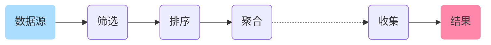

# 流式处理 `Stream Processing`

`Java 8 Api`

流式处理[^流式处理]使用声明的方式处理数据。

[^流式处理]: Stream Processing。流式处理是一种数据处理方式，它将数据视为流，通过对流的处理，从而实现对数据的处理。

在流式处理中，数据如水流一般在管道中传输，并在节点上进行筛选、排序、聚合等中间操作的处理，最后由终结操作生成结果。

流式处理模式图：



## 1&emsp;流式处理是什么？

流是一个支持聚合操作的来自数据源的元素队列。

- **元素** 是形成队列的特定类型的对象。流并不会存储元素，而只是按需计算。
- **数据源** 是流的来源。可以是集合、数组、`I/O channel`、 `generator` 等。
- **聚合操作** 对流进行处理，如 `filter` `map` `reduce` `find` `match` `sorted` 等。

不同于集合操作， 流式操作还有两个基础的特征：

- `管道流` 中间操作都会返回流对象本身。这样一来，多个操作就可以串联成一个管道。这可以方便地对操作进行优化，比如延迟执行[^延迟执行]和短路[^短路]。
- `内部迭代` 以前对集合遍历都是通过 `Iterator` 或 `For-Each` 的方式，以外部迭代方式显式地在集合外部进行迭代。而流式操作则通过访问者模式[^访问者模式]实现了内部迭代。

[^延迟执行]: Lazy Evaluation / Laziness，又称惰性化。延迟执行的方法在调用时不会立即执行，而是在需要结果时才执行。

[^短路]: Short-circuiting。短路是指在不需要处理所有元素的情况下就可以结束对元素的处理。

[^访问者模式]: Visitor。访问者模式是一种将数据操作与数据结构分离的设计模式。

## 2&emsp;流式处理的优势

- **声明式**：更简洁、更易读。
- **可复用**：流操作可以像数据结构一样复用。
- **并行化**：流的操作可以很方便地并行化，而无需显式地编写多线程代码。
- **易于优化**：流的延迟执行和短路操作使得流操作可以高效地执行。

## 3&emsp;流式处理的操作

当你有一条流时，你可以对它进行以下操作：

### 中间操作[^中间操作]

[^中间操作]: Intermediate operation。中间操作是指可以对流中的元素进行处理，并且仍返回流的操作。

中间操作会返回一个新的流，且同一个流可以跟随零个或多个中间操作。它们在运行时会打开流，对元素执行各种操作，再合并流并传给下一项中间操作。这类操作都是惰性化[^延迟执行]的，也就是说，在调用这类方法时并不会真正开始对流进行处理。只有当流的[终止操作](#终止操作6)被执行时，它们才会随之执行。

#### 筛选 `filter`

筛选操作可以将符合条件的元素从流中筛选出来，形成新的流。

```java
List<String> days = Arrays.asList("Saturday", "Sunday", "Monday");
List<String> result = days.stream()    // 将集合转换为流。
        .filter(holiday -> ("Saturday".equals(holiday) || "Sunday".equals(holiday))) // 筛选出属于周末的元素（星期一不是假期😭）。
        .collect(Collectors.toList());    // 收集元素并转换为集合。
```

上述例子中的 `filter` 操作会返回一个新的流，其中包含了不是星期一的元素。这个新的流可以继续进行其他操作，比如 `map` `sorted` 等。

为流中的元素进行筛选时，推荐使用 `Lambda 表达式` 。如果你对这种写法感到陌生，可以去看看我的学习笔记。

[`Lambda 表达式 ↗`](/notebook/java/lambda)

当然，你可以用 `Lambda 表达式` 实现更多的筛选操作，比如：

```java
List<Integer> numbers = Arrays.asList(1, 2, 3, 4, 5, 6, 7, 8, 9)
List<Integer> result = number.stream()
        .filter(number -> number % 2 == 0)    // 筛选出偶数。
        .filter(number -> number > 5)         // 筛选出大于5的数。
        .collect(Collectors.toList());        // 显而易见，result的元素只有6和8。
```

#### 映射 `map` `flatMap`

映射操作可以将流中的元素映射为另一种形式或内容，形成新的流。

##### 简单映射 `map`

简单映射操作可以将流中的每一个元素分别加工处理、映射为另一个元素，并组成新的流。

一个简单的示例是将流中的每个字符串转换为大写：

```java
List<String> days = Arrays.asList("Saturday", "Sunday", "Monday");
List<String> result = days.stream()
        .map(String::toUpperCase)         // 将每个字符串转换为大写。
        .collect(Collectors.toList());    // 结果为：[SATURDAY, SUNDAY, MONDAY]。
```

当然，你可以将元素映射为任何类型，比如：

```java
List<String> names = Arrays.asList("Tom", "Jerry", "Mike");
List<Integer> result = names.stream()
        .map(String::length)              // 将每个字符串映射为字符串的长度。
        .collect(Collectors.toList());    // 结果为：[3, 5, 4]。
```

##### 扁平化映射 `flatMap`

扁平化映射操作可以将多个流中的每一个元素分别处理，并将所有流合并为一个流，例如将 `Stream<Stream<E>>` 合并为 `Stream<E>` 。

简而言之，你可以将它视为针对多维数组的简单映射操作，或是汇聚零碎流的操作。

```java
List<Integer> numbers1 = Arrays.asList(1, 2, 3);
List<Integer> numbers2 = Arrays.asList(4, 5, 6);

List<Integer> result = Stream.of(numbers1, numbers2)    // 将两个集合转换为流。
        .flatMap(Collection::stream)                    // 将两个流合并为一个流。
        .collect(Collectors.toList());                  // 结果为：[1, 2, 3, 4, 5, 6]。
```

你可以用扁平化映射大幅简化多条流的合并处理操作。

#### 排序 `sorted`

排序操作可以将流中的元素进行排序，并组成新的流。

如果你不添加参数，则会按照自然排序规则对元素进行排序。

```java
List<Integer> numbers = Arrays.asList(3, 1, 2, 5, 4);
List<Integer> result = numbers.stream()
        .sorted()                         // 按照自然排序规则对元素进行排序。
        .collect(Collectors.toList());    // 结果为：[1, 2, 3, 4, 5]。
```

如果你想要自定义排序规则，可以使用 `sorted(Comparator)` 方法，比如进行降序排序：

```java
List<Integer> numbers = Arrays.asList(3, 1, 2, 5, 4);
List<Integer> result = numbers.stream()
        .sorted(Comparator.reverseOrder())    // 按照降序排序规则对元素进行排序。
        .collect(Collectors.toList());        // 结果为：[5, 4, 3, 2, 1]。
```

使用 `Comparator` 接口的 `comparing` 方法自定义排序规则：

```java
List<String> names = Arrays.asList("Tom", "Jerry", "Mike");
List<String> result = names.stream()
        .sorted(Comparator.comparing(String::length))    // 按照字符串长度进行排序。
        .collect(Collectors.toList());                   // 结果为：[Tom, Mike, Jerry]。
```

如果你想了解有关 `Comparator` 的更多信息，可以去看看我的 `Comparator` 学习笔记（coming soon!）。

#### 聚合 `distinct`

聚合是一个很简单的无参操作，用于去除流中重复的元素。

```java
List<Integer> numbers = Arrays.asList(1, 2, 3, 0, 5, 2, 3, 6, 0, 2);
List<Integer> result = numbers.stream()
        .distinct()                       // 去除重复的元素。
        .collect(Collectors.toList());    // 结果为：[1, 2, 3, 0, 5, 6]。
```

#### 截断 `limit`

截断操作可以将流中的元素截断，只取从前往后指定数量的元素。

```java
List<Integer> numbers = Arrays.asList(1, 2, 3, 4, 5);
List<Integer> result = numbers.stream()
        .limit(3)                         // 截取前三个元素。
        .collect(Collectors.toList());    // 结果为：[1, 2, 3]。
```

#### 跳过 `skip`

跳过操作与截断操作相辅相成，它可以将流中的元素跳过，只取后面的元素。

```java
List<Integer> numbers = Arrays.asList(1, 2, 3, 4, 5);
List<Integer> result = numbers.stream()
        .skip(3)                          // 跳过前三个元素。
        .collect(Collectors.toList());    // 结果为：[4, 5]。
```

你可以引入流的长度数据，以实现从后往前截取元素的效果：

```java
List<Integer> numbers = Arrays.asList(1, 2, 3, 4, 5);
List<Integer> result = numbers.stream()
        .skip(numbers.size() - 3)         // 跳过前两个元素，相当于截取后三个元素。
        .collect(Collectors.toList());    // 结果为：[3, 4, 5]。
```

#### 冒泡 `peek`

冒泡操作可以对流中的每个元素进行一些操作，但不同于映射操作的是，它仍然返回之前的流。因此，冒泡操作前后，元素的类型不会发生变化。

```java
List<Integer> numbers = Arrays.asList(1, 2, 3, 4, 5);
List<Integer> result = numbers.stream()
        .peek(number -> number * 2)       // 遍历每个元素，并将其乘以二。
        .collect(Collectors.toList());    // 结果为：[2, 4, 6, 8, 10]。
```

### 终止操作[^终止操作]

[^终止操作]: Terminate Operations。终止操作是指对流进行最终处理的操作，它们会返回一个非流的结果。

终止操作作为流的最后一个操作，会返回一个非流的结果，比如 `List`、`Integer` 等。而且只有终止操作才会触发流的执行，因为中间操作都是惰性化[^延迟执行]的。因此，终止操作之后，流就不能再被使用了。

#### 匹配 `allMatch` `anyMatch` `noneMatch`

匹配操作可以用于判断流中的元素是否满足某个条件。

##### 全部匹配 `allMatch`

全部匹配用于判断流中的所有元素是否都满足某个条件，下面的示例中，我们判断流中的所有元素是否都大于0。

```java
List<Integer> numbers = Arrays.asList(1, 2, 3, 4, 5);
boolean result = numbers.stream()
        .allMatch(number -> number > 0);    // 结果为：true。
```

特别地，如果流为空，则会无视评估谓词并返回 `true` 。

当你不需要确定结果时，可以使全部匹配发生短路现象[^短路]（待补充）。

##### 任意匹配 `anyMatch`

任意匹配用于判断流中是否存在任意一个元素满足某个条件，下面的示例中，我们判断流中是否存在任意一个元素的第一个字符为大写。

```java
List<String> words = Arrays.asList("Hello", "world", "javaCodes");
boolean result = words.stream()
        .anyMatch(word -> Character.isUpperCase(word.charAt(0)));    // 结果为：true。
```

特别地，如果流为空，则会无视评估谓词并返回 `false` 。

当你不需要确定结果时，可以使任意匹配发生短路现象[^短路]（待补充）。

##### 无匹配 `noneMatch`

无匹配用于判断流中是否不存在任意一个元素满足某个条件，下面的示例中，我们判断流中是否不存在任意一个元素的长度为5，条件等价于判断流中的所有元素的长度是否都不为5。

```java
List<String> words = Arrays.asList("Hello", "World", "Java");
boolean result = words.stream()
        .noneMatch(word -> word.length() == 5);    // 结果为：false，因为流中存在长度为5的单词"Hello"和"World"。
```

为了帮助你理解，在下面的示例中我们使用无匹配来判断流中是否不存在任意一个整数2。

```java
List<Integer> numbers = Arrays.asList(1, 3, 5, 7, 9);
boolean result = numbers.stream()
        .noneMatch(number -> number == 2);    // 结果为：true，因为流中不存在整数2。
```

特别地，如果流为空，则会无视评估谓词并返回 `true` 。

当你不需要确定结果时，可以使无匹配发生短路现象[^短路]（待补充）。

#### 遍历 `forEach`

遍历操作用于遍历流中的元素，无返回类型。

```java
List<String> messages = Arrays.asList("Hello", " ", "World", "!");
messages.stream().forEach(message -> System.out.print(message));    // 输出："Hello World!"。
```

在上述示例中，我们使用 `forEach` 遍历了 `messages` 中的所有元素，并将其打印出来。

#### 查找 `findFirst` `findAny`

查找操作可以用于从流中查找一个符合条件的元素。

查找操作的返回值为 `Optional` 类型。这是一种特殊的容器，它可以包含一个值，也可以不包含任何值。我们可以用 `Optional[对象]` 来代表包含对象的 `Optional` 类型。

特别地，空的 `Optional` 类型对应 `Optional.empty()` 。

##### 顺序查找 `findFirst`

顺序查找用于从流中查找第一个符合条件的元素，下面的示例中，我们查找流中第一个偶数。

```java
List<Integer> numbers = Arrays.asList(1, 3, 6, 7, 9);
Optional<Integer> result = numbers.stream()
        .filter(number -> number % 2 == 0)
        .findFirst();    // 结果为：Optional[6]。
```

特别地，如果流为空，则会返回一个空的 `Optional` ；如果流不存在顺序，则可能返回任何一个元素。

##### 并行查找 `findAny`

并行查找用于从流中查找任意一个符合条件的元素，下面的示例中，我们查找流中任意一个偶数。

```java
List<Integer> numbers = Arrays.asList(1, 3, 6, 7, 9, 10, 11, 12);
Optional<Integer> result = numbers.parallelStream()
        .filter(number -> number % 2 == 0)
        .findAny();    // 结果为：Optional[6] 或 Optional[10] 或 Optional[12]。
```

注意，并行查找是明确短路[^短路]的，这意味着它具有明确不确定性。多次调用并行查找的返回值可能是流中任意符合要求的元素之一。

特别地，如果流为空，则会返回一个空的 `Optional` ；如果所选元素为 `null` ，则会抛出空指针异常。

#### 归约 `reduce`

归约操作用于将流中的元素归约为一个值。归约操作的返回值为 `Optional` 类型。

##### 无初始值的归约

无初始值的归约用于将流中的元素归约为一个值，下面的示例中，我们将流中的元素归约为一个整数，这个整数是流中所有元素的和。

```java
List<Integer> numbers = Arrays.asList(1, 3, 5, 7);
Optional<Integer> result = numbers.stream()
        .reduce((number1, number2) -> number1 + number2);    // 结果为：Optional[16]。
```

特别地，如果流为空，则会返回一个空的 `Optional` 。

##### 有初始值的归约

有初始值的归约相比于无初始值的归约多了一项参数，以防止返回值为空。下面的示例中，我们指定了初始值 `0` ，并对元素求和。

```java
List<Integer> numbers = Arrays.asList(1, 3, 5, 7);
Optional<Integer> result = numbers.stream()
        .reduce(0, (number1, number2) -> number1 + number2);    // 结果为：Optional[16]。
```

特别地，如果流为空，则会返回一个包含初始值的 `Optional` ，在上述示例中，就是 `Optional[0]` 。

我们可以通过归约操作方便地对流进行求和、求积、求最大值、求最小值等一系列操作。如下是求和操作的示例：

```java
List<Integer> numbers = Arrays.asList(1, 3, 5, 7);
Optional<Integer> result = numbers.stream()
        .reduce(0, Integer::sum);    // 结果为：Optional[16]。
```

我们也可以使用多参数的 `Lambda 表达式` 来实现求和操作：

```java
List<Integer> numbers = Arrays.asList(1, 3, 5, 7);
Optional<Integer> result = numbers.stream()
        .reduce(0, (number1, number2) -> number1 + number2);    // 结果为：Optional[16]。
```

#### 收集 `collect`

收集是常用的终止操作之一，用于将流中的元素收集到一个容器中。收集操作的返回值为 `Optional` 类型。

##### 无初始值的收集

无初始值的收集用于将流中的元素收集到一个容器中，下面的示例中，我们将流中的所有数取整并收集到一个 `List` 中。

```java
List<Integer> numbers = Arrays.asList(1.1, 2, 3.0F, 6 - 2);
Optional<List<Integer>> result = numbers.stream()
        .map(number -> (int) Math.round(number))
        .collect(Collectors.toList());    // 结果为：Optional[[1, 2, 3, 4]]。
```

特别地，如果流为空，则会返回一个空的 `Optional` 。

##### 有初始值的收集

有初始值的收集相比于无初始值的收集多了一项参数，以防止返回值为空。下面的示例中，我们指定了初始值 `0` ，并将流中的所有数取整再求和。因为我们进行了求和操作，所以收集的结果不再是 `List` 类型。

```java
List<Integer> numbers = Arrays.asList(1.1, 2, 3.0F, 6 - 2);
Optional<Integer> result = numbers.stream()
        .map(number -> (int) Math.round(number))
        .collect(0, (number1, number2) -> number1 + number2);    // 结果为：Optional[10]。
```

特别地，如果流为空，则会返回一个包含初始值的 `Optional` ，在上述示例中，就是 `Optional[0]` 。

#### 转换 `toList` `toSet` `toMap`

转换操作用于将流中的元素转换为其他类型，返回值即为对应类型。

##### 转换为有序集合 `toList`

转换为有序集合操作用于将流中的元素转换为 `List` 类型。

##### 转换为无序集合 `toSet`

转换为无序集合操作用于将流中的元素转换为 `Set` 类型，可以去除重复项。

##### 转换为键-值对集合 `toMap`

转换为键-值对集合操作用于将流中的元素转换为 `Map` 类型，需要指定键和值的映射函数。

假设我们仍然对三位篮球运动员的信息进行处理，但我们想获得一个以球员名字作为键，球员队伍作为值的集合，我们可以这样做：

```java
Map<String, String> result = players.stream()
        .collect(Collectors.toMap(Player::getName, Player::getTeam));    // 结果为：{James=Lakers, Kobe=Lakers, Curry=Warriors}。
```

如果你无法确保每名球员的名字都是唯一的，那么你可以使用 `toMap` 的重载方法来指定当键重复时的处理方式：

```java
Map<String, String> result = players.stream()
        .collect(Collectors.toMap(Player::getName, Player::getTeam, (oldValue, newValue) -> newValue));    // 结果仍然为：{James=Lakers, Kobe=Lakers, Curry=Warriors}，因为没有重复的球员名字。
```

其中的重载方法 `(oldValue, newValue) -> newValue` 规定了当键重复时，新值会覆盖旧值。
